!-- This file gives an insight of how to:

1: Automate the provisioning of two Ubuntu-based servers, named "Master" and "Slave", using Vagrant.

2: Write a bash script to automate the deployment of a LAMP (Linux, Apache, MySQL, PHP) stack on the master node .

2a: The bash script should clone a PHP application from GitHub(laravel), install all necessary packages, and configure Apache web server and MySQL. 

3: With Ansible Playbook:

  - Execute the bash script on the Slave node

-  Create a cron job to check the server's uptime every 12 am.

Install software properties, update and upgrade server.

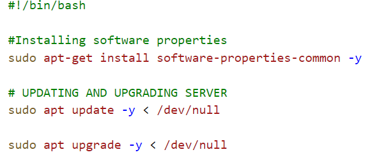

1: Automating Master and Slave machine and setting disk storage with Vagrant.
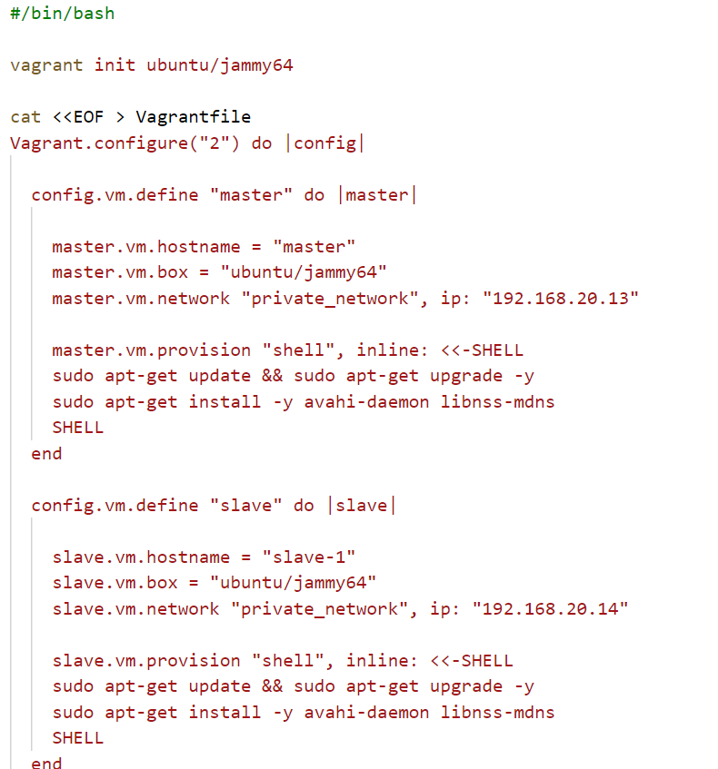

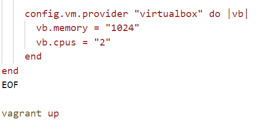

2: Deployment of LAMP stack on the Master node with bash script.
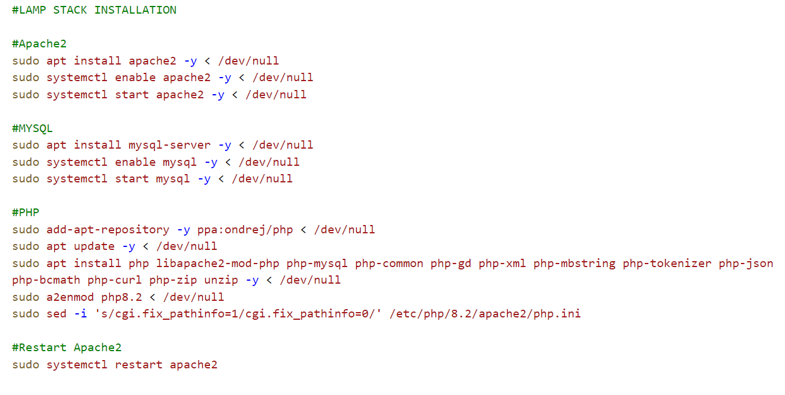

2a: Installing Composer
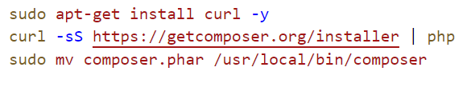

Configuring and restarting Apache web server

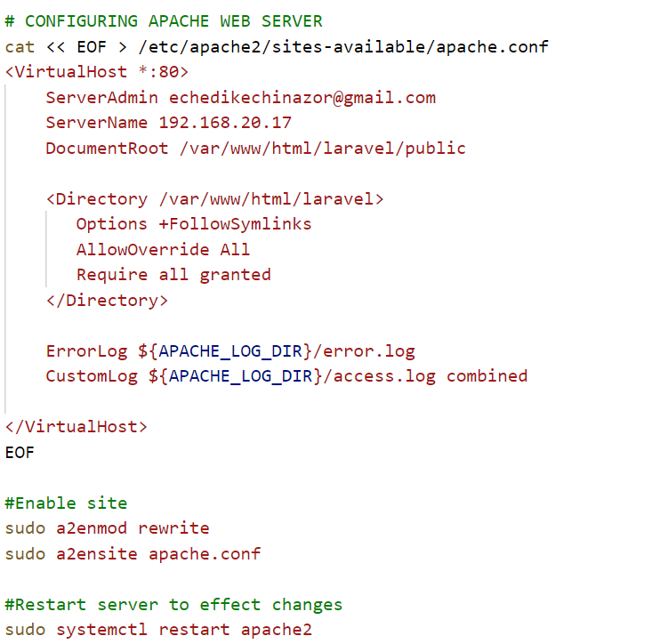

Cloning Laravel;

- First, i installed git, then i cloned the PHP application(laravel) from github, and changed the ownership of /var/www/html/laravel to www-data to enable it access the files in the /var/www/html/laravel directory, also changed permissions in the directory. Then i copied the files in .env.example file to .env file

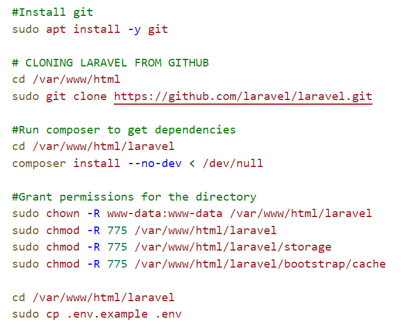

Configuring MYSQL and creating a database.

- In the .env file created earlier, i updated the mysql database name and username and also created a password.

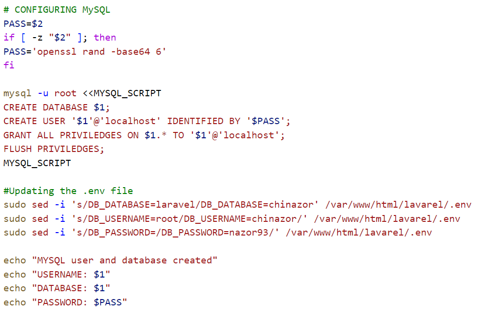

Generatig PHP key

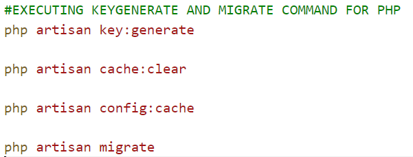

N/B: To run this script on the master node, i used the command:

- bash laravel.sh chinazor nazor93
- < /dev/null makes the script non interactive

3: Ansible Playbook: The Ansible Playbook has 1 directory and 3 files.

- files: This directory contains the script that will be executed on the slave node.

- ansible.cfg: This provides configuration settings for the ansible

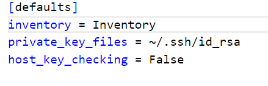

- inventory: This is where the host machine that ansible will connect to is located.

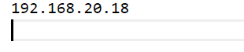

- script.yaml file: This file contains the play that will be executed.

I updated and upgraded the host server, then i created a cronjob to check the server's uptime every 12am

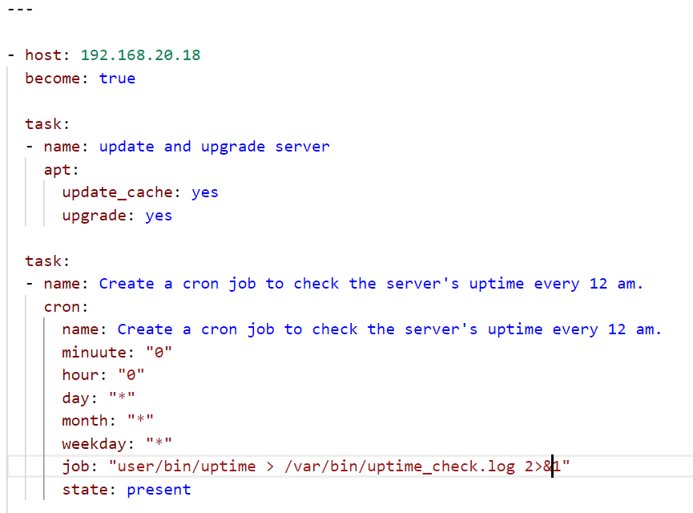

- The first task is to copy the bash script from the files directory to the root of the slave machine, and then change the permissions.
- The second task sets permission to execute the script
- The third task executes the script

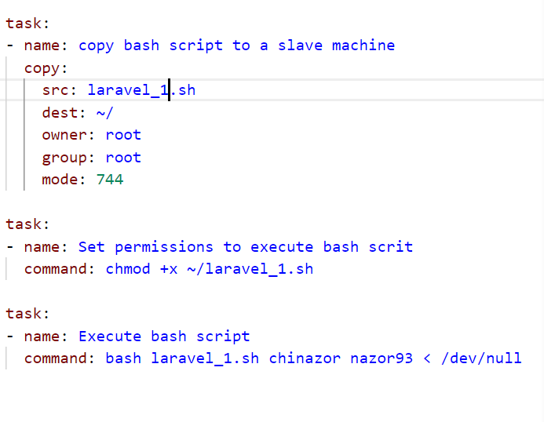

N/B: To run the ansible playbook, i used the comman:

- ansible-playbook -i inventory script.yaml -->

